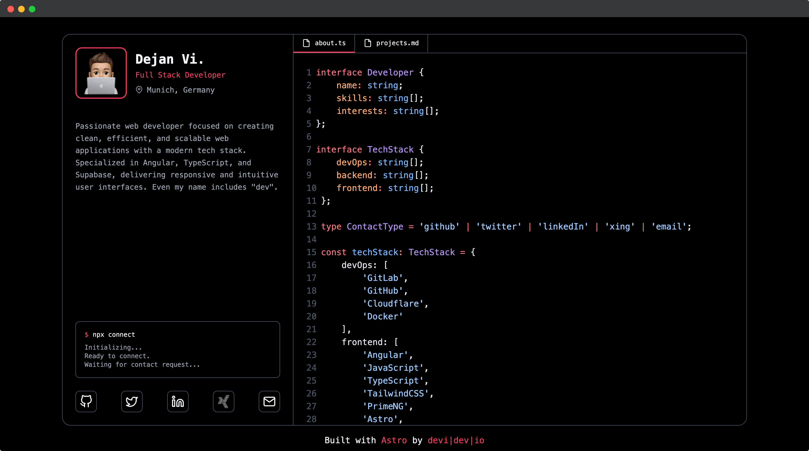
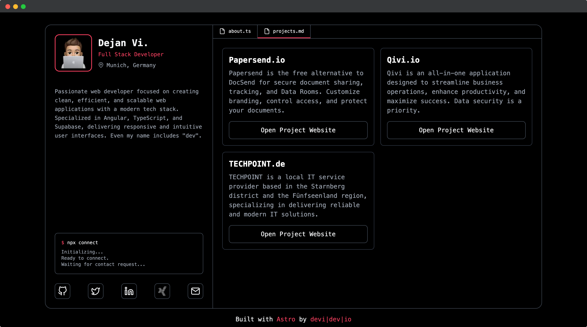

# 🚀 NexoDev — Portafolio de Desarrollador con Astro

Un portafolio minimalista, moderno y totalmente personalizable, desarrollado por **Malcom Sandoval (NexoDev)** con [Astro](https://astro.build/) y [TailwindCSS](https://tailwindcss.com/).  
Optimizado para velocidad, rendimiento y estilo limpio — sin JavaScript en el build final.

---

## 🌐 Demo
Explora una demostración real: **[nexodev.vercel.app](https://nexodev.vercel.app)** *(o el dominio que uses)*




---

## ✨ Características principales
- ⚡ **Sin JavaScript en producción:** 100% optimizado con Astro para máximo rendimiento.  
- 📱 **Totalmente responsivo:** se adapta a cualquier dispositivo con un diseño limpio y moderno.  
- 🔍 **Optimizado para SEO y redes sociales:** incluye metadatos para OpenGraph, Twitter y DublinCore.  
- 💯 **Puntaje 100/100 en Google PageSpeed:** tanto en móvil como en escritorio.  
- 🧠 **Resaltado de código integrado:** gracias a [Shiki](https://github.com/shikijs/shiki).  
- 💼 **Portafolio y vitrina de proyectos:** muestra tus trabajos de forma profesional.  
- 🧩 **Diseño inspirado en editores de código:** estética moderna y enfocada en desarrolladores.

---

## 🧰 Stack Tecnológico
- [Astro](https://astro.build/) — Framework ultrarrápido basado en componentes.  
- [TailwindCSS](https://tailwindcss.com/) — Utilidades para un diseño flexible y responsivo.  
- [Shiki](https://github.com/shikijs/shiki) — Resaltado de sintaxis elegante y personalizable.

---

## ⚙️ Primeros pasos

```bash
# 1. Clonar el repositorio
git clone https://github.com/nexodev/astro-portfolio .

# 2. Instalar dependencias
npm install

# 3. Iniciar el entorno de desarrollo
npm run dev

# 4. Compilar para producción
npm run build

# Luego despliega el contenido de la carpeta `./dist` en tu hosting preferido.
